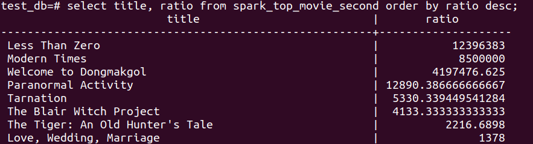
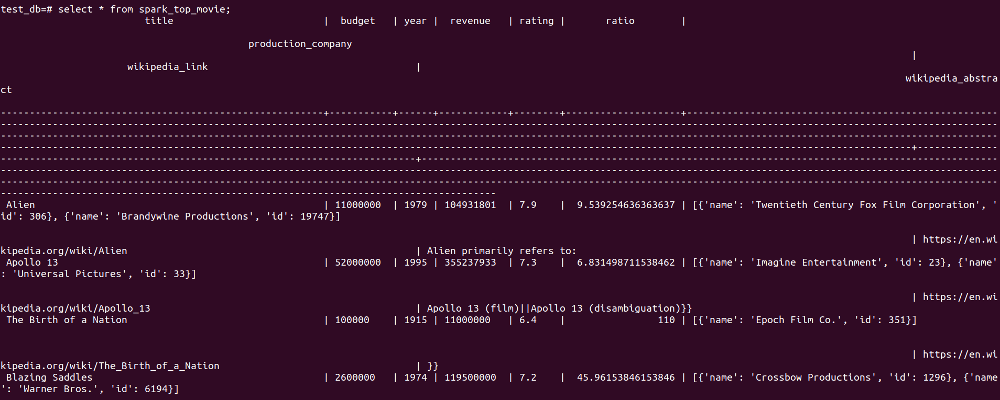

# tl-true-film code challenge
## How to Run
Install the following (Linux (Ubuntu))
- Install maven version 3.6.3
    - sudo apt install maven
- Install Java 8
  - sudo apt-get install openjdk-8-jdk
- Install Scala 2.11
  - sudo apt-get install scala
- Install spark 2.4.4
  - guide: https://computingforgeeks.com/how-to-install-apache-spark-on-ubuntu-debian/
### Optional Docker Setup
credit to source for docker steps and compose file: https://towardsdatascience.com/how-to-run-postgresql-using-docker-15bf87b452d4

Option to set up docker image postgres
1. Install docker
2. Install docker-compose
3. cd into same dir as docker-compose.yml (supplied in repo)
4. run "sudo docker-compose up --force-recreate"
5. run "docker exec -it postgres_container bash"
6. run "psql -h pg_container -d test_db -U root -f infile"
7. run "psql -h postgres_container -d test_db -U root
8. Now data can be queried
   1. Can query top_movie table that was created after spark job
   has run.
   2. get all from table: select * from top_movie;
9. If not using docker can query from wherever accessing 
postgres db from.

    
10. Select all: "select * from top_movie"
    
### Once installation complete
1. cd into movie_loader directory in tl-true-file project
2. run mvn clean install, this will build the jar needed
to run application
3. Jar can be found under movie-loader/target
4. From command line: spark-submit --master local --driver-memory 1g --executor-memory 1g --driver-java-options "-Dml.dbUrl=jdbc:postgresql://127.0.0.1:5432/test_db
   -Dml.movieMetaDataPath=/home/sean/Downloads/archive/movies_metadata.csv -Dml.wikipediaDataPath=/home/sean/Downloads/data
   -Dml.topAmount=1000 -Dml.tableName=top_movie" --class com.tl.app.MovieLoader /home/sean/work/tl-true-film/movie-loader/target/movie-loader-1.0-SNAPSHOT.jar
5. Explanation of arguments:
   1. dbUrl: address of the database
   2. movieMetaDataPath: the path to the dataset containing
   movie metadata
   3. wikipediaDataPath: path to the wikipedia dataset will be
   faster to point to extracted data rather than tar.gz as Spark
   will not need to extract it as it reads.
   4. topAmount: this the value to get the top n number of movies
   by their ratio
   5. tableName: the name of the table we wish to write to
   6. class: points to the class to use
   7. finally, path to jar that we previously built
6. Optional Arguments:
   1. outputToFile: boolean output to csv file instead of 
   write to db set as false by default.
   2. dbUser: database user, set to root by default
   3. dbPassword: set database password, set as root by default
   4. outputPath:empty path by default if outputting to 
   file, the path to write to

## Tools & Languages
- Maven
- Scala
- Apache Spark

1. Maven is used to build the jar which is used to run 
the application. Easy to configure and will easily allow
for new processors/ loaders to be added should there be any
additional ETL jobs required.
2. When using Spark the main two options are Python and Scala.
3. Using scala as jar can be easily packaged and deployed with
the necessary dependencies in an uber-jar. Spark submit will 
point to this jar when running the data load job.
4. Spark is highly configurable, so if data format is to change
then it is a trivial change in Spark.
5. In built functions allow for easier data processing. User
regex_replace and year for processing the year from a date
6. Should the data volume increase and the spark application
be deployed to an AWS resource such as EMR then the number
of executor nodes and memory can be configured to suit the job's
needs.
7. From the output as displayed in this application can be
written to a csv file if desired instead of a postgres db.

8. The above tools were selected as they enable an application
to grow in a number of ways.
   - Application Functions: adding additional capabilities
   - Data: Should the volume increase, we can create a larger
   cluster to accommodate this.

## Algorithmic choices
1. MetaData movie reading and processing
   - Calculate the ratio column required in output
   - Divide the revenue by the budget
   - For these purposes I considered 0 budget to be invalid
as it would cause divide by zero error. Worth considering if
there is an alternative, perhaps assigning a default value
   - For getting the year, used inbuilt spark function that
   we can extract from the release_date column
   - rename vote_average to rating as cross-referenced with
   imdb website can see this is what the value signifies
   - cache this data so data would not need to be reloaded
   when used again
2. Wikipedia Data
   - Compared to metadata, large amount of data
   - Transform title column and remove "Wikipedia: " from title
   we will use this as our join key with metadata dataset
   - Rename, abstract and link columns
3. Joining and outputting data
   - From metadata dataset we have title column, from wikipedia
    dataset we have the new title column we created via regex_replace. 
   We join on this column to form the beginning of our output data.
   - We then select the columns we wish to keep and will be
used in our write to postgres. 
   - Columns referenced by these variables, TITLE_COLUMN_NAME, BUDGET_COLUMN_NAME, YEAR_COLUMN_NAME, REVENUE_COLUMN_NAME,
     RATING_COLUMN_NAME, RATIO_COLUMN_NAME, PRODUCTION_COMPANY_COLUMN_NAME,
     WIKI_LINK_COLUMN_NAME, WIKI_ABSTRACT_COLUMN_NAME
   - order by the ratio as we want the movies with the highest 
ratio
   - topAmount should be set to 1000 in spark-submit this is
   the value that we then limit the output on
   - used a broadcast join as the size of metadata dataset was
   relatively small this should increase performance as each executor 
   get a copy of this dataset and reduces shuffles as a result.
4. Additional Considerations
   - When joining on the title column and title column we created 
   from wikipedia. We do an inner join, this means we need to have
   the wikipedia article title match the movie title. Also, 
   this will remove any entries that don't have a corresponding article.
   Given the spec, I think it is best to only keep movies with
   a corresponding wikipedia page.

## Test for correctness
1. Integration Test
 - Having test cases that test edge cases and happy path will 
help ensure etl job is operating correctly.
 - I have added an integration test that runs the spark job
 - This will help test for correctness as we have a small
input and can be sure that it is behaving as expected and verify
the output.
2. Verifying output
 - Can examine output in database with initial count and
check columns are matching desired output as per spec.
  - Compare output against expected output as supplied by 
  business stakeholder
  - Examine the metadata associated with the task, ensure that
  the columns that are being outputted type match with the
  business requirement.
3. Also, important to measure how long the ETL job is taking
to highlight possible areas for improvement and optimization
4. Data quality, examine the output and identify percentage 
of incorrect output, illegal characters or columns containing null 
when they are not nullable.
5. Can run a series of sql queries over the output to ensure
each row is as expected.

